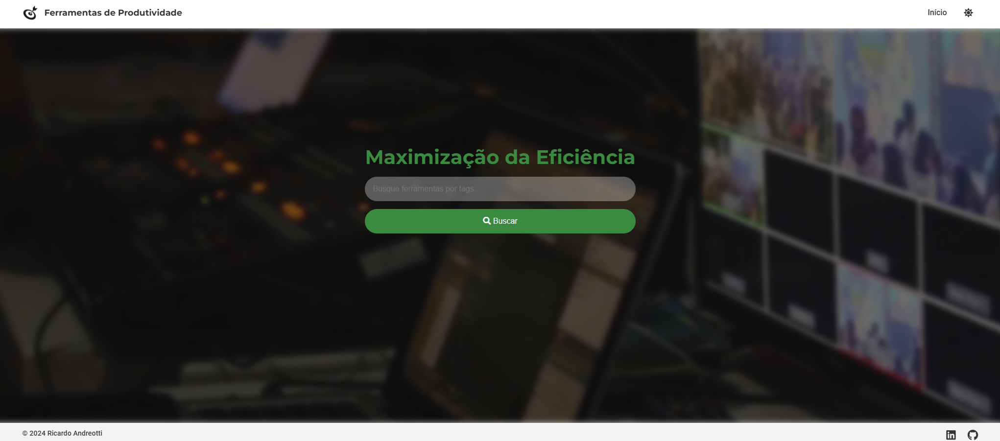
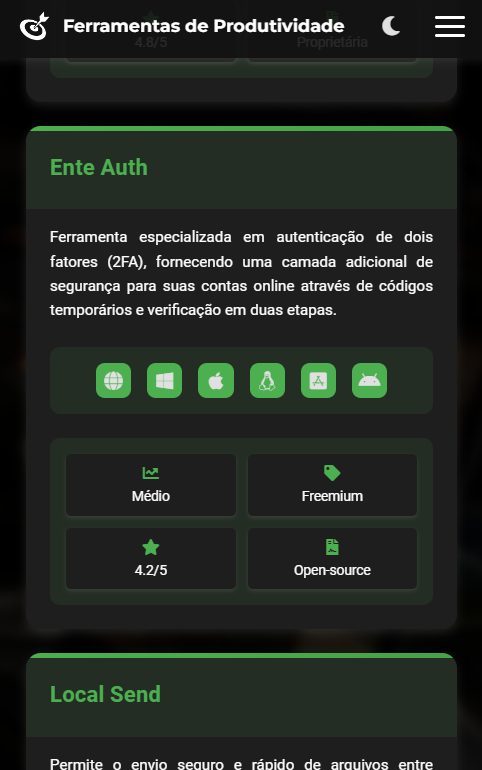
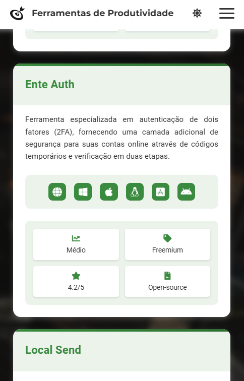

# 🎲 Desafio Alura: Base de Pesquisa
<p align="center">
  <!-- Contador de linguagens do GitHub -->
  
  <!-- Tamanho do repositório no GitHub -->
  
  <!-- Licença do GitHub -->
  
</p>

<div align="center">
  
</div>

## 📋 Sobre o Projeto
Este projeto é uma aplicação web desenvolvida durante uma imersão. A plataforma tem como objetivo apresentar e pesquisar ferramentas de produtividade, facilitando a descoberta e a exploração de soluções úteis para o trabalho e a organização pessoal.

## ⚙️ Funcionalidades Principais
- **Campo de Pesquisa**: Permite buscar ferramentas por tags ou nomes.
- **Exibição Dinâmica de Ferramentas**: Ferramentas são mostradas em cartões interativos.
- **Detalhes dos Cartões**: Cada cartão fornece informações detalhadas, incluindo:
  - Título
  - Descrição
  - Plataformas Suportadas
  - Dificuldade
  - Preço
  - Popularidade
  - Licença

## 🛠 Tecnologias Utilizadas
- **CSS3**: Para estilização, com ênfase em flexbox e grid para layouts responsivos.
- **JavaScript Vanilla**: Para interatividade e manipulação do DOM.
- **HTML5**: Para estruturação do conteúdo.

## ✨ Características Adicionais
- **Animações e Transições Suaves**: Melhoram a experiência do usuário com efeitos visuais agradáveis.
- **Integração com Font Awesome**: Para uma interface mais intuitiva com ícones.
- **Menu Hamburguer**: Melhorada a navegação em dispositivos móveis.

## 🌐 Visualize o Projeto
Você pode visualizar o projeto online através deste [link](https://devandreotti.github.io/essential-tools-navigator/).

## 🚀 Futuras Melhorias e Ideias
- [ ] **Filtros Personalizados**: Adicionar filtros por categoria e preço.
- [ ] **Avaliações e Comentários**: Permitir avaliações e comentários dos usuários.
- [ ] **Login e Favoritos**: Criar sistema de login e salvar ferramentas favoritas.
- [ ] **Comparação de Ferramentas**: Adicionar funcionalidade de comparação.
- [ ] **Algoritmo de Recomendação**: Desenvolver recomendações personalizadas.
- [ ] **Tutoriais e Guias**: Adicionar tutoriais e guias úteis.
- [ ] **Experiência Offline**: Implementar PWA para uso offline.
- [ ] **Suporte a Múltiplos Idiomas**: Adicionar suporte para vários idiomas.
- [ ] **Compartilhamento Social**: Facilitar o compartilhamento em redes sociais.

## 📂 Estrutura do Projeto
```
├── src/                                    # Diretório principal do código-fonte
│   ├── css/                                # Arquivos de estilo CSS
│   │   ├── responsive.css                  # Estilos para responsividade
│   │   └── style.css                       # Estilos principais
│   └── js/                                 # Scripts JavaScript
│       ├── app.js                          # Lógica principal da aplicação
│       ├── data.js                         # Gerenciamento de dados
│       ├── menu.js                         # Funcionalidades do menu
│       └── theme.js                        # Gerenciamento de temas
├── index.html                              # Página principal do projeto
└── README.md                               # Documentação do projeto
```

## 📱 Demo
<div align="center">
  
  
</div>

## 🧭 Guia de Implementação
1. **Clone o repositório**:
   ```bash
   git clone https://github.com/devAndreotti/APS-01.git
   ```
2. **Abra o arquivo `index.html` no navegador**.

## 💪 Como Contribuir
Contribuições são bem-vindas! Siga estas etapas para colaborar:
1. Faça um fork do projeto.
2. Crie uma nova branch para sua feature: `git checkout -b feature/nome-feature`.
3. Commit suas mudanças: `git commit -m 'Adiciona nova feature'`.
4. Envie para a branch: `git push origin feature/nome-feature`.
5. Abra um Pull Request.

## 📝 Nota
Este projeto foi desenvolvido em uma imersão da Alura em parceria com o Google, focando em práticas modernas de HTML, CSS e JavaScript.
