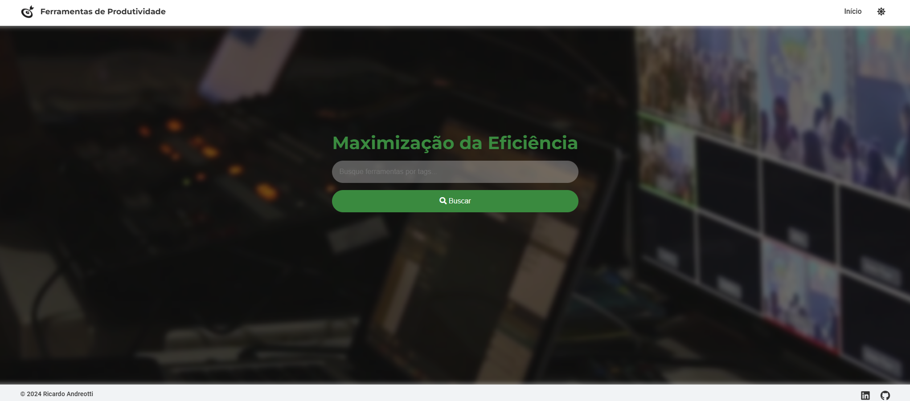
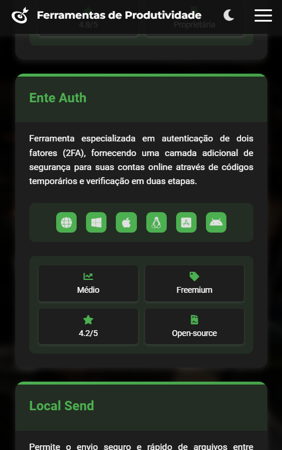
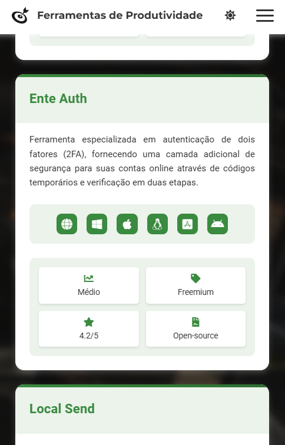

<!-- Projeto Finalizado -->
# 🔎 Desafio Alura: Base de Pesquisa
<p align="center">
  <!-- Contador de linguagens do GitHub -->
  
  <!-- Tamanho do repositório no GitHub -->
  
  <!-- Licença do GitHub -->
  
</p>

<div align="center">
  
</div>

## 📋 Sobre o Projeto
Este projeto é uma aplicação web desenvolvida durante uma imersão. A plataforma tem como objetivo apresentar e pesquisar ferramentas de produtividade, facilitando a descoberta e a exploração de soluções úteis para o trabalho e a organização pessoal.

## ⚙️ Funcionalidades Principais
- **Exibição Dinâmica de Ferramentas**: Ferramentas são mostradas em cartões interativos.
- **Campo de Pesquisa**: Permite buscar ferramentas por categorias ou nomes.
- **Detalhes dos Cartões**: Cada cartão fornece informações detalhadas.

## 🛠 Tecnologias Utilizadas
- **CSS3**: Para estilização, com ênfase em flexbox e grid para layouts responsivos.
- **JavaScript Vanilla**: Para interatividade e manipulação do DOM.
- **HTML5**: Para estruturação do conteúdo.

## 🌌 Contexto do Projeto
O Essential Tools Navigator foi desenvolvido durante a Imersão Dev com Google Gemini, um evento de treinamento intensivo focado em tecnologias de desenvolvimento web, com a ajuda do Gemini. A Imersão foi hospedada pela Alura.
<div>
  
</div>

## 🌐 Visualize o Projeto
Você pode visualizar o projeto online através deste [link](https://devandreotti.github.io/essential-tools-navigator/).

## 📂 Estrutura do Projeto
```
├── src/                                    # Diretório principal do código-fonte
│   ├── css/                                # Arquivos de estilo CSS
│   │   ├── responsive.css                  # Estilos para responsividade
│   │   └── style.css                       # Estilos principais
│   └── js/                                 # Scripts JavaScript
│       ├── app.js                          # Lógica principal da aplicação
│       ├── data.js                         # Gerenciamento de dados
│       ├── menu.js                         # Funcionalidades do menu
│       └── theme.js                        # Gerenciamento de temas
├── index.html                              # Página principal do projeto
└── README.md                               # Documentação do projeto
```

## 🧭 Guia de Implementação
1. **Clone o repositório**:
   ```bash
   git clone https://github.com/devAndreotti/essential-tools-navigator.git
   ```
2. **Abra o arquivo `index.html` no navegador**.

## ✒️ Características Adicionais
- **Animações e Transições Suaves**: Melhoram a experiência do usuário com efeitos visuais agradáveis.
- **Integração com Font Awesome**: Para uma interface mais intuitiva com ícones.
- **Menu Hamburguer**: Melhorada a navegação em dispositivos móveis.

## 📱 Demo
<div align="center">
  
  
</div>

## 🚀 Futuras Melhorias
- [ ] **Login e Favoritos**: Criar um sistema de login e salvar ferramentas favoritas.
- [ ] **Avaliações e Comentários**: Permitir avaliações e comentários dos usuários.
- [ ] **Suporte a Múltiplos Idiomas**: Adicionar suporte para vários idiomas.
- [ ] **Compartilhamento**: Facilitar o compartilhamento em redes sociais.
- [ ] **Filtros Personalizados**: Adicionar filtros por tags e preço.
- [ ] **Experiência Offline**: Implementar PWA para uso offline.
- [ ] **Tutoriais e Guias**: Adicionar tutoriais e guias úteis.
- [ ] **Barra de Navegação**: Adicionar mais itens.

## 💪 Como Contribuir
Contribuições são bem-vindas! Siga estas etapas para colaborar:
1. Faça um fork do projeto.
2. Crie uma nova branch para sua feature: `git checkout -b feature/nome-feature`.
3. Commit suas mudanças: `git commit -m 'Adiciona nova feature'`.
4. Envie para a branch: `git push origin feature/nome-feature`.
5. Abra um Pull Request.

## 📝 Nota
Este projeto foi desenvolvido em uma imersão da **Alura** em parceria com o **Google**, focando em práticas modernas de HTML, CSS e JavaScript.

<br>

---

<p align="center">
  Desenvolvido por <a href="https://github.com/seuUsuario">Ricardo Andreotti Gonçalves</a> 🧑‍💻
</p>

---
