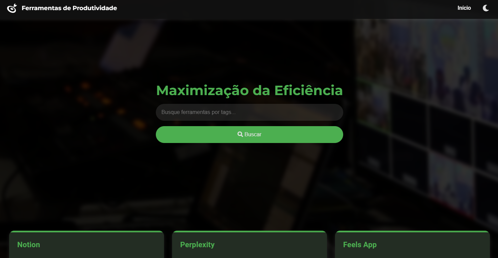

# 🚀 Alura: Base de Conhecimento
<p align="center">
  <!-- Contador de linguagens do GitHub -->
  
  <!-- Tamanho do repositório no GitHub -->
  
  <!-- Licença do GitHub -->
  
</p>

<div align="center">
  
</div>

## 📋 Sobre o Projeto
Este projeto é uma aplicação web responsiva que demonstra boas práticas de desenvolvimento front-end, incluindo design responsivo, gerenciamento de temas e funcionalidades de menu dinâmico.

## 🌟 Características Principais
Design Responsivo: Layout adaptável para diferentes tamanhos de tela.
Gerenciamento de Temas: Suporte para múltiplos temas visuais.
Menu Dinâmico: Funcionalidade de menu interativo e responsivo.
Gerenciamento de Dados: Manipulação eficiente de dados da aplicação.

## ⚙️ Funcionalidades
- [x] Arquivos JavaScript modulares para organização (`app.js`, `data.js`, `menu.js`, `theme.js`).
- [x] Estilos CSS separados para manutenção (`style.css`, `responsive.css`).
- [x] Gerenciamento de temas (claro/escuro) via JavaScript.
- [x] Estrutura HTML5 semântica para acessibilidade e SEO.
- [x] Manipulação e gerenciamento de dados em JavaScript.
- [x] Design responsivo adaptável a diferentes telas.
- [x] Interatividade e animações na interface
- [x] Lógica centralizada em `app.js`.
- [x] Estilização moderna com CSS3.
- [x] Menu dinâmico e responsivo.

## 🛠 Tecnologias
- **JavaScript**
- **HTML5**
- **CSS3**

## 🧭 Guia de Implementação
1. **Clone o repositório**:
   ```bash
   git clone https://github.com/devAndreotti/APS-01.git
   ```
2. **Abra o arquivo `index.html` no navegador**.

## 🚀 Estrutura do Projeto
```
├── src/                                    # Diretório principal do código-fonte
│   ├── css/                                # Arquivos de estilo CSS
│   │   ├── responsive.css                  # Estilos para responsividade
│   │   └── style.css                       # Estilos principais
│   └── js/                                 # Scripts JavaScript
│       ├── app.js                          # Lógica principal da aplicação
│       ├── data.js                         # Gerenciamento de dados
│       ├── menu.js                         # Funcionalidades do menu
│       └── theme.js                        # Gerenciamento de temas
├── index.html                              # Página principal do projeto
└── README.md                               # Documentação do projeto
```

## 📱 Demo
<div align="center">
  
  
</div>

# 💪 Como Contribuir
Contribuições são bem-vindas! Siga estas etapas para colaborar:
1. Faça um fork do projeto.
2. Crie uma nova branch para sua feature: `git checkout -b feature/nome-feature`.
3. Commit suas mudanças: `git commit -m 'Adiciona nova feature'`.
4. Envie para a branch: `git push origin feature/nome-feature`.
5. Abra um Pull Request.

# 📝 Nota
Este projeto foi desenvolvido em uma imersão da Alura em parceria com o Google, focando em práticas modernas de HTML, CSS e JavaScript.
